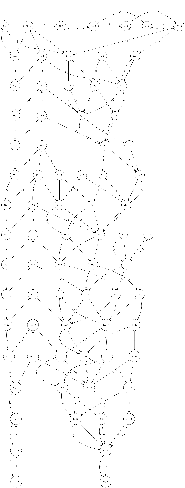

The `learnBG` function in `Main.java` learns a **Behavior Graph** from a teacher (OCA).

### Sample Inputs and Outputs

Here are some example inputs and their corresponding outputs from the `learnBG` function:

In the images below, in a vertex/state if the label is `13, 5` then 13 is the name (meaningless) for that state and **5 is the counter value** at that state.

#### Example 1  
**Input:** [`anbna(a+b)(a+b)`](images/OCA%20for%20image1.txt) `depth (d) = 15`  

**Output:**

#### Example 2  
**Input:** [`(anbn)even_a`](images/OCA%20for%20image2.txt) `depth (d) = 5`

**Output:**

#### Example 3  
**Input:** [`anbna`](images/OCA%20for%20image1.txt) `depth (d) = 8`

**Output:**

